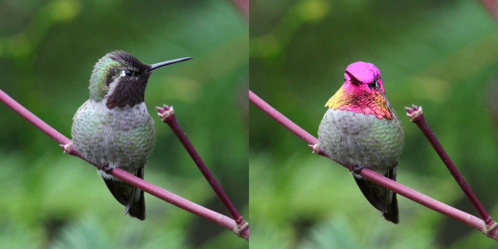
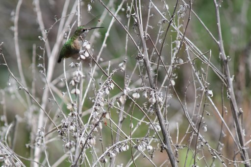
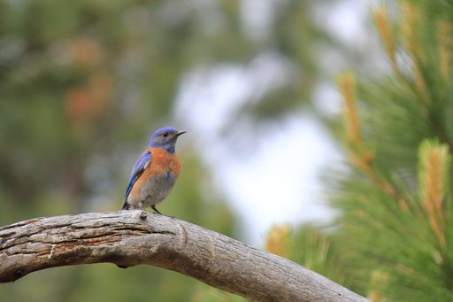
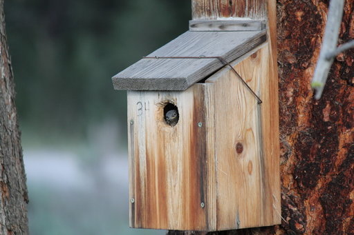
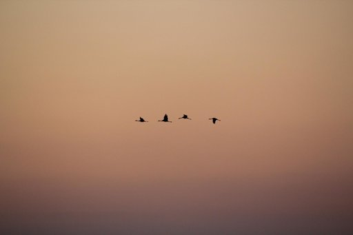

```{r setup, include=FALSE}
knitr::opts_chunk$set(echo = FALSE)

# Learn more about creating websites with Distill at:
# https://rstudio.github.io/distill/website.html

```

# Structures producing iridescence in hummingbirds

All 336 hummingbirds species have iridescent colours, because of multilayer
structures located in their feathers. But the structures of only a handful of
them have been observed and characterised to date. Yet, the extraordinary
diversity of hummingbird colours and the fact that structures are highly
variable in other groups, such as starlings, suggest that there might be a large
interspecific variation in the characteristics of the multilayer.

<aside>
Featured at:

- Living Light 2018
- II Joint Congress of Evolutionary Biology
</aside>

# New method for iridescence measurements

```{r, fig.cap="Change in colour with the angle of observation in a male Anna's hummingbird. Collage created from a video by Mick Thompson, CC BY-NC, <https://flic.kr/p/JDwh9K>", out.extra="class=external"}

```

Iridescent colours are widespread among living organisms and have been the
specific focus on many colour scientists and evolutionary biologists for a long
time. However, in spite of this, they have often be measured in the same way as
non-iridescent colours, thus leaving out a possibly biologically feature: their
angular dependency. The main difficulty lies in the identification of a small
number of variable that could summarise the colour on each point in the angle
space. This can be done using optical theory from physics, which allows us to
predict qualitatively how iridescent colours change with the angle. This reveals
that 6 variables are enough to summarise all characteristics of colours (hue,
brightness and saturation) at all point in the angle space, and provide a
convenient and reliable way to estimate these 6 variables with a small number of
measurements.

<aside>

- Best talk award at the 5th Young Natural History Scientists conference.
- Work published in [Interface Focus](https://doi.org/10.1098/rsfs.2018.0049)

</aside>

# Iridescence and competition in hummingbird communities


The number of colours efficient for communication in a given environment is
limited. Sympatric species that are similar in behaviour thus likely compete for
colours. On the other hand, common ancestry and camouflage tend to drive colour
evolution towards similar patterns among species. In the tropical rainforest,
many close-related hummingbirds species co-occur. Furthermore, hummingbirds
display a wide range of colours due to the micro-organisation of their
melanosomes. Hummingbirds are thus an outstanding model to study colour
competition and evolution problematics.

<aside>

- Featured by the [musée des Confluences](http://www.museedesconfluences.fr/fr/liridescence-chez-les-colibris)
<!-- Link backed up on the wayback machine -->
- Published in the [Peer Community Journal](https://doi.org/10.24072/pcjournal.7)
- Summarised by a [poster](src/poster_eseb.pdf) presented at theESEB2019 conference](https://app.oxfordabstracts.com/events/653/program-app/submission/133885)

</aside>

# Past projects

## How interspecific interactions shape species range



A classic view is that better competitor will exclude lesser competitors. It is
established that under some conditions, lesser competitors can coexist with a
better competitor by shifting their range or their phenology for example.
However, the effect of lesser competitors on the superior competitor are more
rarely studied. Bluebirds are convenient species to study this question. Indeed,
Mountain bluebirds have recently been displaced from their historical range by
the more aggressive Western bluebirds. However, Western bluebirds colonization
seems to stop at higher elevation. Which mechanism allow Mountain bluebirds to
stay in those high elevation areas in spite of the close presence of the closely
related Western bluebirds?

## Fire as a selective pressure: the case of *Sorghum stipoideum*


The Kimberley, located in the north-west of Australia, is one of the most
fire-prone ecosystem in the world. Annual grasses are submitted to fast
evolution and usually have very large populations, making them good models to
study the selective pressure induced by fire. My project focused on the effect
of fire on *Sorghum stipoideum*, the most abundant grass in this savanna
ecosystem.

## Study of common birds communities



Lack of data is one of the major issue in ecology and conservation sciences. One
way to get a lot of data is the emergent concept of *citizen science*. Moreover,
integrating citizens in the research process leads them to feel more concerned
about environment and conservation. In this study, I analyzed data of a new
citizen-observatory: [oiseuxdesjardins.fr](http://www.oiseauxdesjardins.fr) and
showed that it provides high quality data, which may be used in research works.

<aside>

Work featured in [L'oiseau mag n°114](https://www.lpo.fr/oiseau-magazine/loiseau-magazine-n114)

</aside>

## Influence of en-route meteorological conditions on timing and trajectory of the migration in Common crane (*Grus grus*)



Understanding the environmental factors underlying the timing of migration is a
major concern in conservation sciences. Indeed, being able to predict if birds
will stop at a given stopover enables to organize consciousness-raising actions
or protection programs. Main aims of this work are:

- Prove that the timing of cranes migration depends on meteorological conditions
- At short-term, predict the precise timing of the migration using weather forecast
- At long-term, assess the effect of climate change on the phenology of cranes
