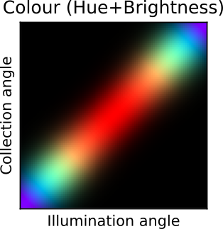

```{r setup, include=FALSE}
knitr::opts_chunk$set(echo = FALSE)

# Learn more about creating websites with Distill at:
# https://rstudio.github.io/distill/website.html

```

<div class="container-fluid" style="margin-top:30px">
<div class="col-lg-8 mx-auto">

<div class="card bg-light mb-4">
<div class="card-header"><h3 class="card-title">Structures producing iridescence in hummingbirds</h3></div>
<div class="card-body">
<p class="card-text text-justify">All 336 hummingbirds species have
iridescent colours, because of multilayer structures located in their
feathers. But the structures of only a handful of them have been
observed and characterised to date. Yet, the extraordinary diversity of
hummingbird colours and the fact that structures are highly variable in
other groups, such as starlings, suggest that there might be a large
interspecific variation in the characteristics of the multilayer.
<p class="card-text text-justify">Featured at:
<ul>
<li>Living Light 2018</li>
<li>II Joint Congress Evolutionary Biology</li>
</ul>
</p>
</div>
</div>

<div class="card bg-light mb-4">
<div class="card-header"><h3 class="card-title">New method for iridescence measurements</h3></div>
<div class="card-body">

<p class="card-text text-justify">
Iridescent colours are widespread among living organisms and
have been the specific focus on many colour scientists and evolutionary
biologists for a long time. However, in spite of this, they have often
be measured in the same way as non-iridescent colours, thus leaving out a
possibly biologically feature: their angular dependency. The main
difficulty lies in the identification of a small number of variable that
could summarise the colour on each point in the angle space. This can be
done using optical theory from physics, which allows us to predict
qualitatively how iridescent colours change with the angle. This reveals
that 6 variables are enough to summarise all characteristics of colours
(hue, brightness and saturation) at all point in the angle space, and
provide a convenient and reliable way to estimate these 6 variables with a small
number of measurements.</p>
<p class="card-text text-justify">Best talk award at the 5th Young Natural History Scientists conference.</p>
<p class="card-text text-justify">Work published in <a href="https://doi.org/10.1098/rsfs.2018.0049">Interface Focus</a>.</p>
</div>
</div>

<div class="card bg-light mb-4">
<div class="card-header"><h3 class="card-title">Iridescence and competition in hummingbird communities</h3></div>
<div class="card-body">

<p class="card-text text-justify">The number of colours efficient for communication in a given
environment is limited. Sympatric species that are similar in
behaviour thus likely compete for colours. On the other hand,
common ancestry and camouflage tend to drive colour evolution
towards similar patterns among species. In the tropical
rainforest, many close-related hummingbirds species co-occur.
Furthermore, hummingbirds display a wide range of colours due to
the micro-organisation of their melanosomes. Hummingbirds are
thus an outstanding model to study colour competition and
evolution problematics.</p>
<p class="card-text text-justify">Work featured by the <a href="http://www.museedesconfluences.fr/fr/liridescence-chez-les-colibris">musée des Confluences</a>.</p>
<!-- Link backed up on the wayback machine -->
<p class="card-text text-justify">Work peer-reviewed and recommended by <a href="https://doi.org/10.24072/pci.evolbiol.100086">Peer Community in Evolutionary Biology</a>.</p>
<p class="card-text text-justify">Summarised by a <a href="src/poster_eseb.pdf">poster</a> presented at the <a href="https://app.oxfordabstracts.com/events/653/program-app/submission/133885">ESEB2019 conference</a>.</p>
</div>
</div>

<div class="card bg-light">
<div class="card-header"><h3 class="card-title">Past projects</h3></div>
<div class="card-body">
<h4 class="card-title">How interspecific interactions shape species range</h4>

<p class="card-text text-justify">A classic view is that better competitor will exclude lesser
  competitors. It is established that under some conditions,
  lesser competitors can coexist with a better competitor by
  shifting their range or their phenology for example. However,
  the effect of lesser competitors on the superior competitor are
  more rarely studied. Bluebirds are convenient species to study
  this question. Indeed, Mountain bluebirds have recently been
  displaced from their historical range by the more aggressive
  Western bluebirds. However, Western bluebirds colonization seems
  to stop at higher elevation. Which mechanism allow Mountain
  bluebirds to stay in those high elevation areas in spite of the
  close presence of the closely related Western bluebirds? </p>
</div>
<div class="card-body">
<h4 class="card-title">
Fire as a selective pressure : the case of <i>Sorghum stipoideum</i>
</h4>

<p class="card-text text-justify">The Kimberley, located in the north-west of Australia, is one of
  the most fire-prone ecosystem in the world. Annual grasses are
  submitted to fast evolution and usually have very large
  populations, making them good models to study the selective
  pressure induced by fire. My project focused on the effect of
  fire on <i>Sorghum stipoideum</i>, the most abundant grass in
  this savanna ecosystem.</p>
</div>

<div class="card-body">
<h4 class="card-title">Study of common birds communities</h4>

<p class="card-text text-justify">Lack of data is one of the major issue in ecology and
  conservation sciences. One way to get a lot of data is the
  emergent concept of <em>citizen science</em>. Moreover,
  integrating citizens in the research process leads them to feel
  more concerned about environment and conservation. In this study,
  I analyze data of a new citizen-observatory:
  <a href=http://www.oiseauxdesjardins.fr>oiseauxdesjardins.fr</a>
  and show that it provides high quality data, which may be used in
  research works.</p>
<p class="card-text text-justify">Work featured in
  <a href="https://www.lpo.fr/oiseau-magazine/loiseau-magazine-n114">
    L'oiseau mag n°114
  </a>.</p>
</div>

<div class="card-body">
<h4 class="card-title">Influence of en-route meteorological conditions on timing and
trajectory of the migration in Common crane (<i>Grus grus</i>)</h4>

<p class="card-text text-justify">Understanding the environmental factors underlying the timing of
  migration is a major concern in conservation sciences. Indeed,
  being able to predict if birds will stop at a given stopover
  enables to organize consciousness-raising actions or protection
  programs. Main aims of this work are:
<ul>
  <li>Prove that the timing of cranes migration depends on
    meteorological conditions</li>
  <li>At short-term, predict the precise timing of the migration
    using weather forecast</li>
  <li>At long-term, assess the effect of climate change on the
    phenology of cranes</li>
</ul>
</p>
</div>
</div>
